## Projecto Backend con JS
### Etapa 1
Se propone la creación de una API REST mediante Javascript, utilizando Node JS y Express como framework principal. Se tienen dos rutas principales formando una arquitectura de Carrito-Producto, propia de comercios electrónicos. 
Primero veamos la estructura de las dos rutas principales:
### */api/products/*

* GET / Deberá listas los productos base.
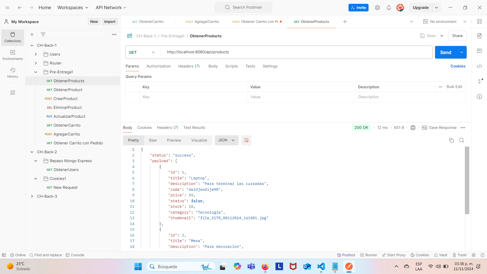  

* GET /:pid Deberá traer sólo el producto con el ID correspondiente.
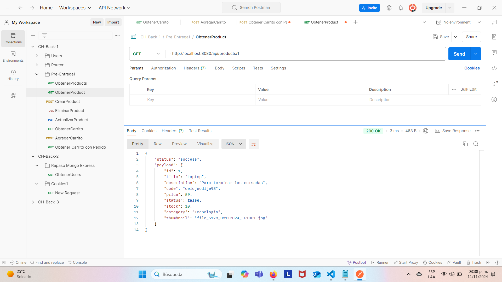  

* POST / Deberá agregar un nuevo producto con los campos:
        * id: Número
        * title: String
        * description: String
        * code: String
        * price: Number
        * status: Boolean --> True por defecto
        * stock: Number
        * category: String
        * thumbnail: Ruta de imagen seleccionada
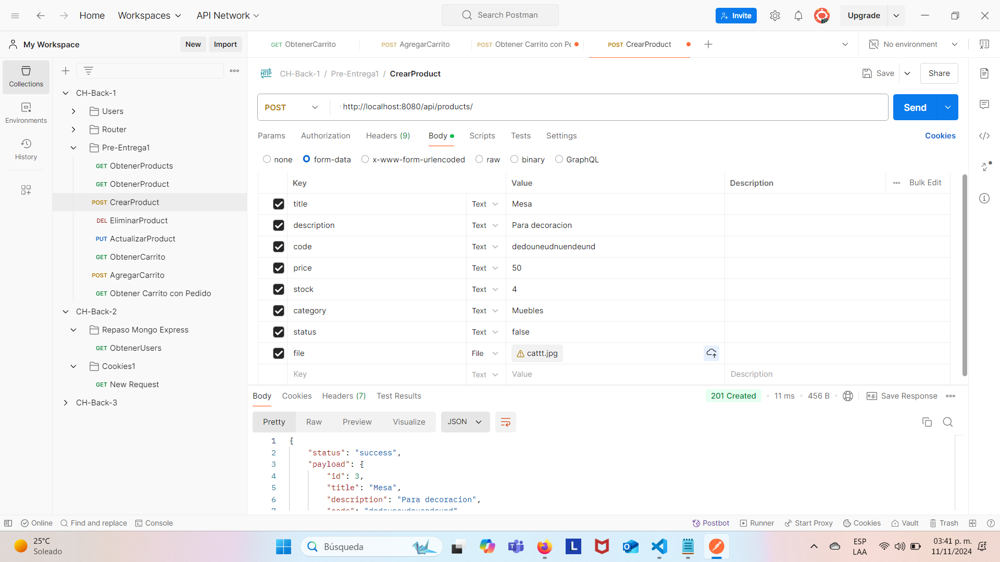  

* PUT /:pid Deberá tomar los campos del método POST, pero ahora para actualizar el registro.
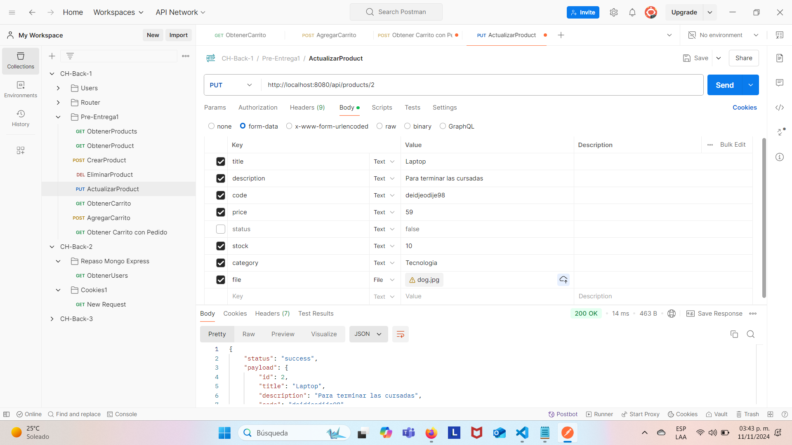  
* DELETE /:pid Deberá eliminar el producto con el pid indicado.
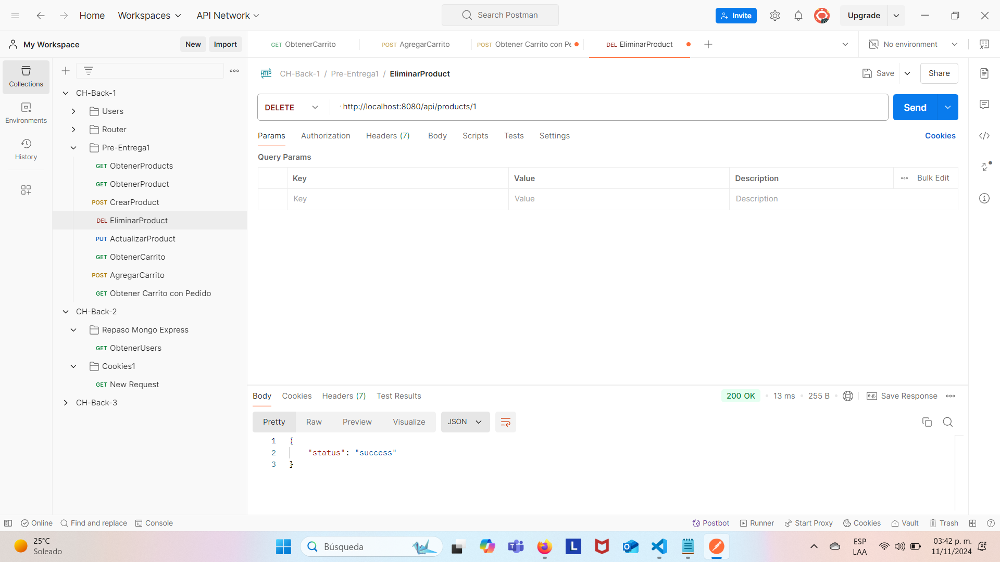  

Ahora, añadiendo un tercer producto, y dejando el status como no requerido, vemos el cambio, pues ahora se paso a true como valor booleano.
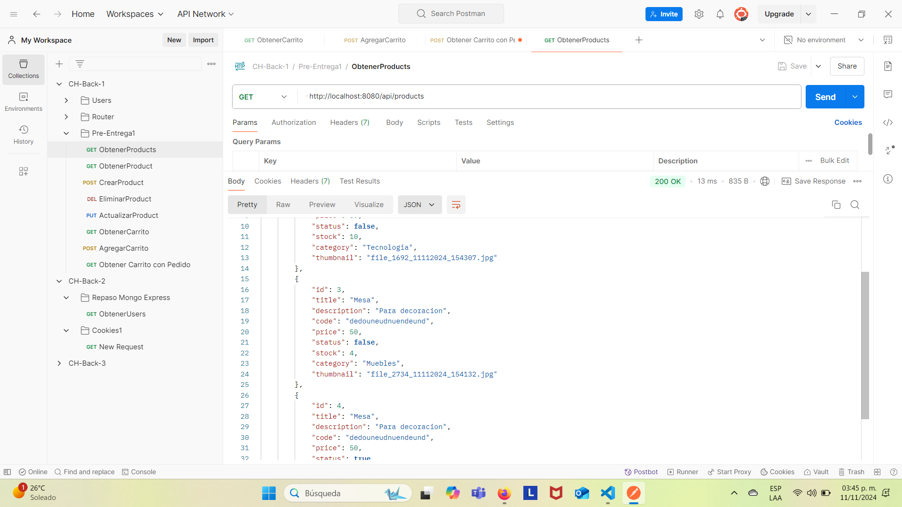  

Por otro lado, si intentamos eliminar otro que no está en nuestra lista de productos.
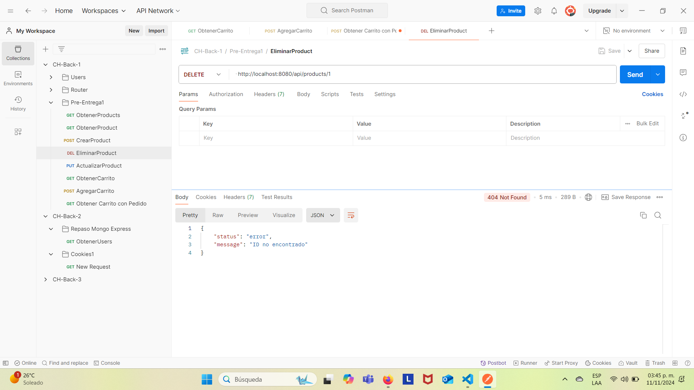  

### */api/carts/*
* POST / Crea un nuevo carrito con nuevo ID y un arreglo vacio al inicio (implementación personal) para que así al momento de hacer el POST no se mande nada como parametro, al fin que el id se generá en automático y no me pareció viable pasar un arreglo vacio en el POST, asi que lo creé desde un inicio así.
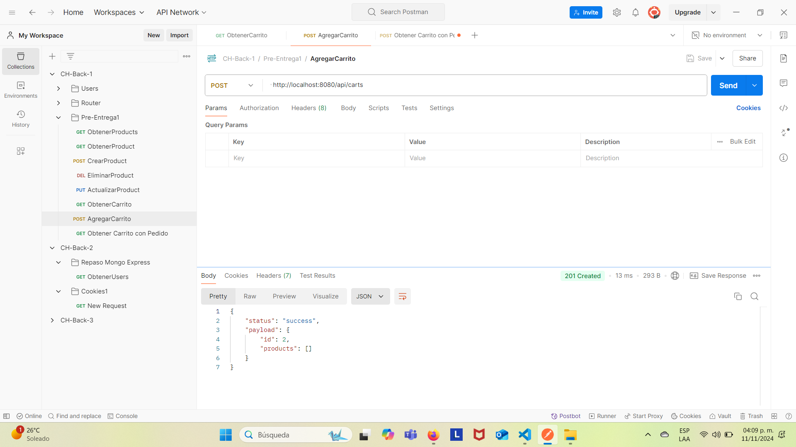

* GET / Obtiene todos los carritos con todos los productos en cada uno de ellos.
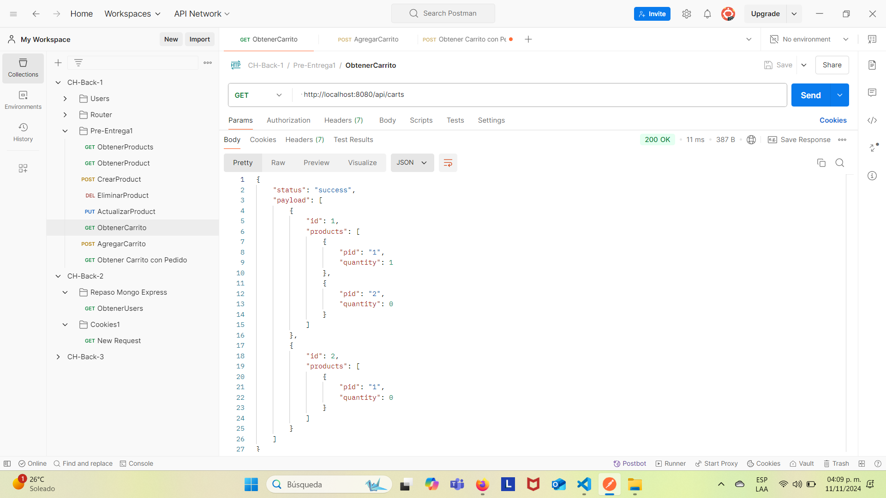
* GET /:cid Obtiene para un sólo carrito, el ID y el arreglo de objetos con los productos propios del carrito.
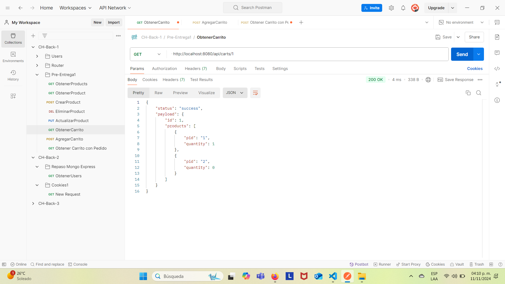

* POST /:cid/product/:pid Agrega un nuevo producto al carrito en cuestión, es decir, utilizando ambos ID, añade el producto con el id pid al carrito con el id de cid. Sin duda este método fue el más laborioso de implementar, porque ya afecta ambos objetos y su interacción no es tan trivial.

### Etapa 2
Se presenta la segunda etapa, implementando handlbars y websockets. Primero el home con handlebars y el template que genera el listado de los productos que se han ido almacenando
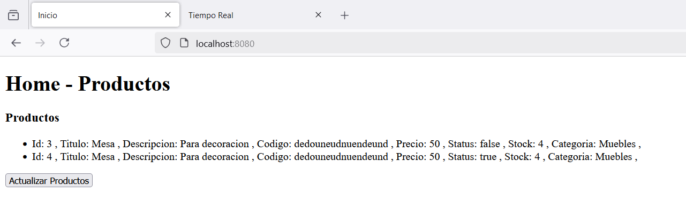

Luego en la ruta de */realTimeProducts* tenemos de igual manera todos los productos, pero con la posibilidad de añadir nuevos mediante un formulario, y teniendo indicadores en el caso de algún error, y botones de confirmación. Vemos que tenemos los mismos productos de la vista anterior
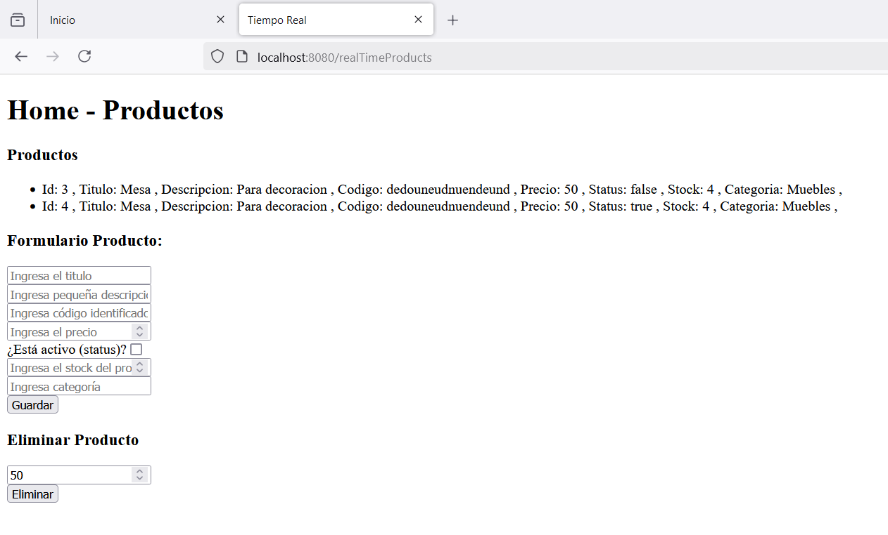

Si llenamos algunos y no todos los datos, tenemos por defecto el mensaje de error y por consiguiente no se genera un nuevo producto
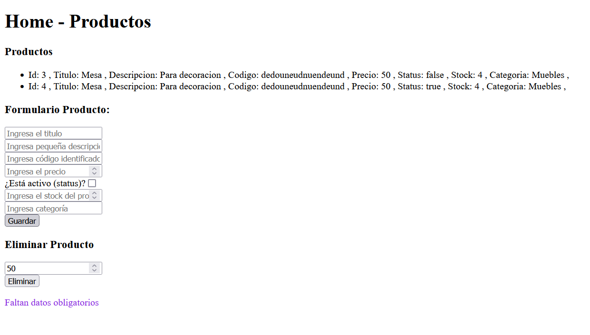

Si ahora queremos borrar un producto ya existente basado en el ID y ponemos uno que no es válido, tenemos el siguiente error informativo
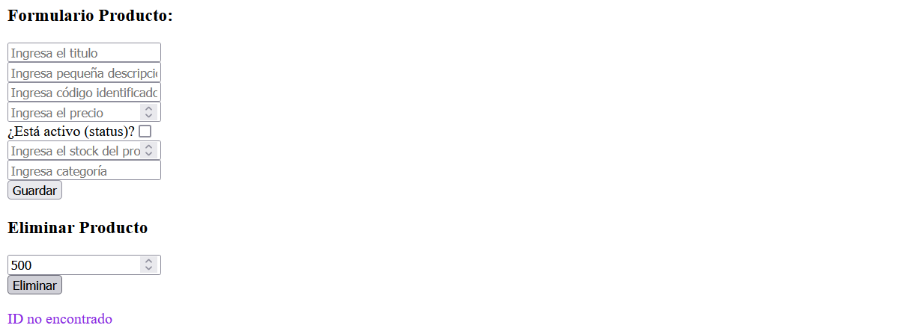

Añadiendo nuevos datos ahora mediante websocket, vemos que se visualiza al instante y por el otro lado, si volvemos a la vista de home, tenemos que dar actualizar al botón y observamos mismos datos

/realTimeProducts             |  /home
:-------------------------:|:-------------------------:
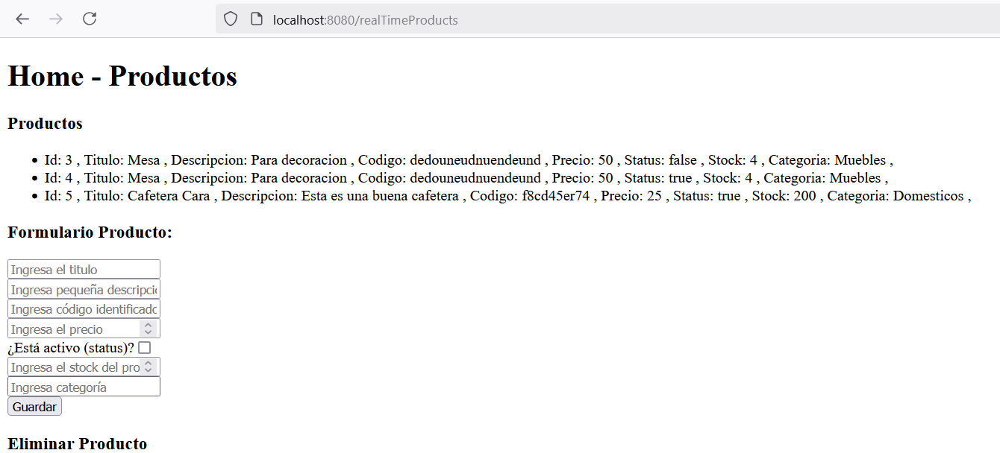  |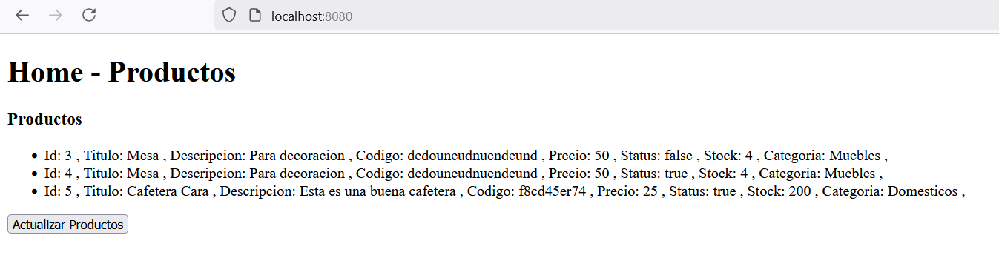

Ahora añadiendo hasta 10 productos, tenemos lo siguiente:

/realTimeProducts             |  /home
:-------------------------:|:-------------------------:
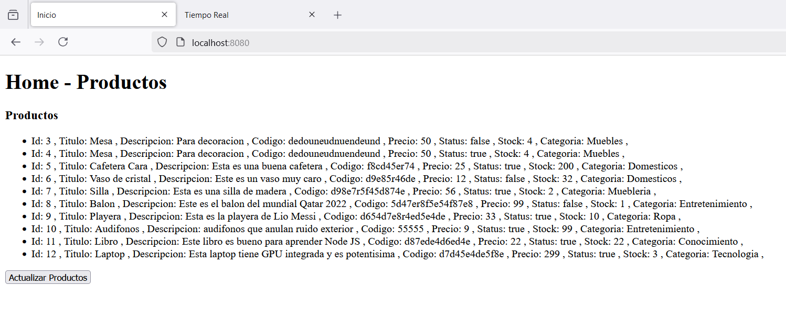  |

A su vez, vemos que se almacena correctamante la información en el FileStorage. Con el thumbail como null como es correspondiente a esta entrega.
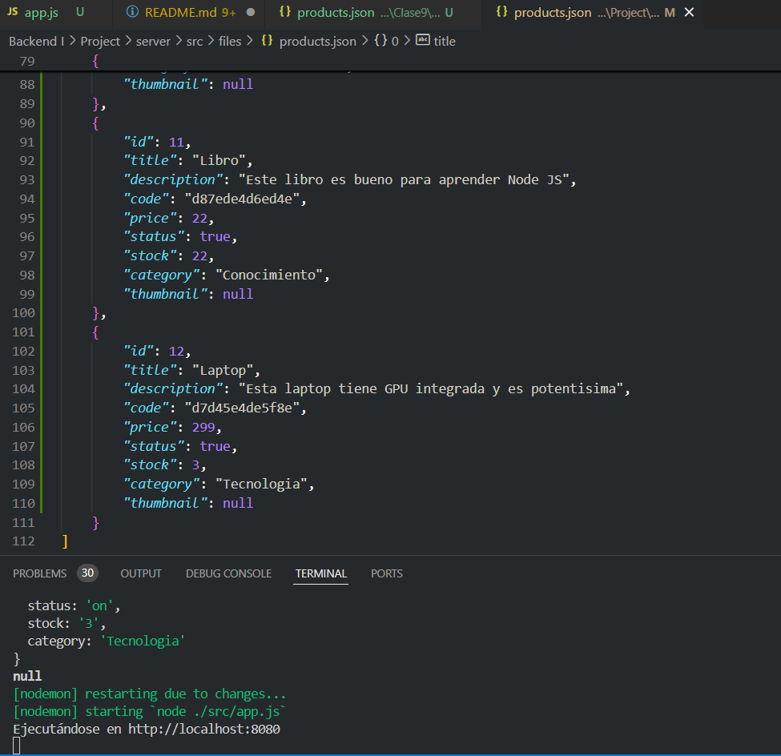

