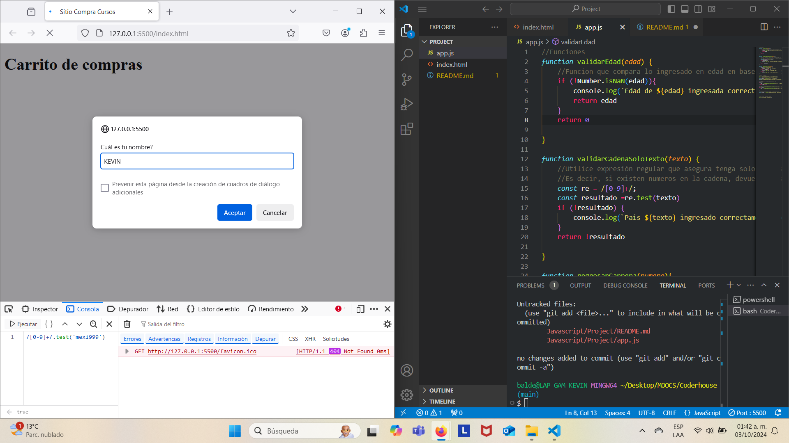
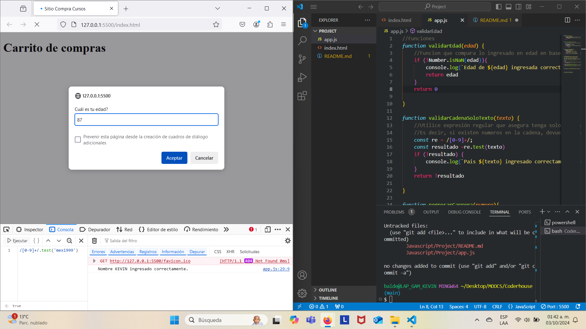
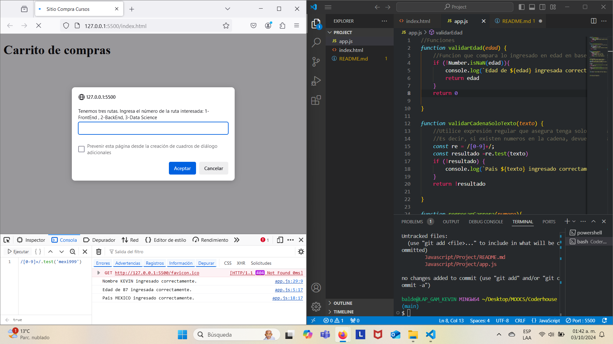

# Projecto Javascript - 6000

## Primera Fase

En esta fase inicial, se utilizan variables, funciones, expresiones regulares para validar entrada por medio de promps y mostrar resultados en consola. A continuación, la pantalla inicial:

Pedimos datos como nombre, para este dato no validamos.

Luego pedimos dato de edad, para lo cual validamos con simplemente viendo si es NaN luego de convertilo a número el string ingresado.

Luego pedimos el dato de país de origen, donde igual validamos con una expresion regular sencilla.

 Primer Intento  | Segundo Intento 
 ------------- | ------------- 
   |   

 Por último, mostramos los datos resultantes de la ruta a cursar con simples condiciones básicos y mostramos en consola.
 