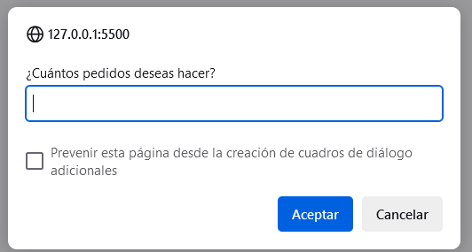
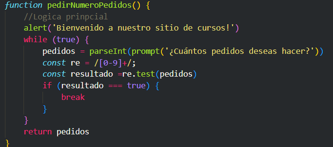
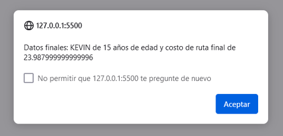
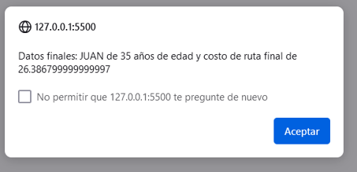
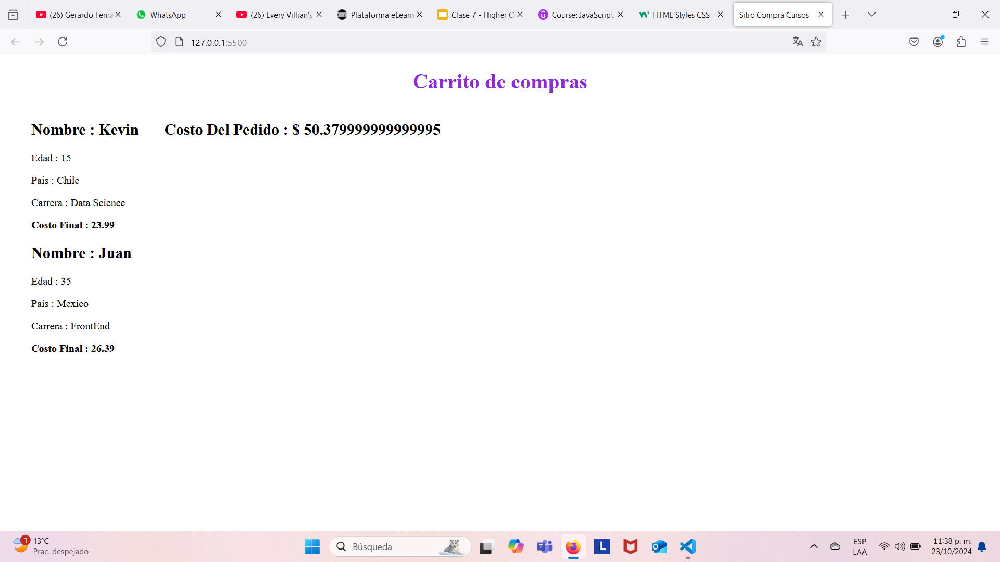
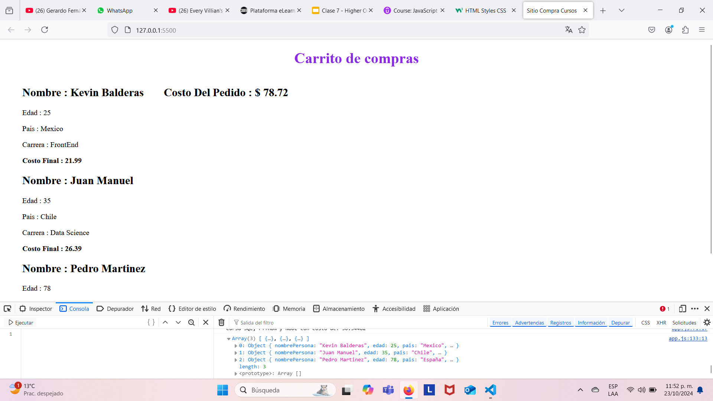
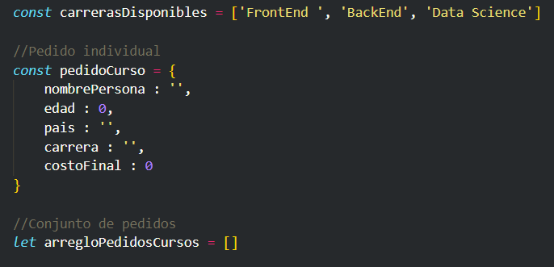
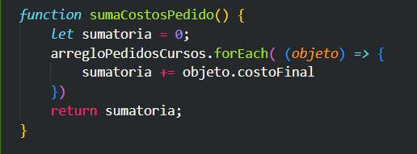

# Projecto Javascript - 6000

## Primera Fase

En esta fase inicial, se utilizan variables, funciones, expresiones regulares para validar entrada por medio de prompts y mostrar resultados en consola. A continuación, la pantalla inicial:

Pedimos datos como nombre, para este dato no validamos.

Luego pedimos dato de edad, para lo cual validamos simplemente viendo si es NaN luego de convertilo a número el string ingresado.

Luego pedimos el dato de país de origen, donde igual validamos con una expresion regular sencilla.

 Primer Intento  | Segundo Intento 
 ------------- | ------------- 
   |   

 Por último, mostramos los datos resultantes de la ruta a cursar con simples condiciones básicos y mostramos en consola.
 

 ## Segunda Fase
 Seguimos apoyándonos de las expresiones regulares para validación de datos de entrada, tenemos alerts y prompts al igual que funciones. También se agrego un catálogo en forma de arreglo con los datos de rutas/cursos disponibles. Luego cada pedido se almacena en forma de objeto, para luego el conjunto de pedidos hacerlo un arreglo de objetos

 Input número pedidos  | Función para número pedidos
 ---------------- | ------------- 
   |   

La primera iteración se realizaron dos pedidos
 Alerta 1er pedido  | Alerta 2o pedido
 ---------------- | ------------- 
   |   

Y el resultado en el HTML fue
 

Luego , conforme vayamos llenando la información se muestra el arreglo de objetos tanto en consola como mediante un DOM sencillo para visualizarlo en el HTML base. Vemos también que se añadió un método que itera sobre el arreglo para obtener la suma de los pedidos y así generar el total que muestra en **Costo Del Pedido**
 

 En específico se utilizaron los siguientes objetos y arreglos:
 Objetos y arreglos  | Función para cálculo de costo total
 ---------------- | ------------- | 
   | 
