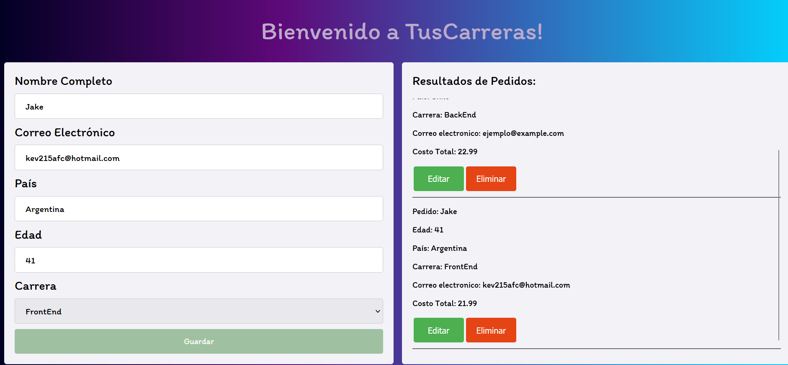

# Projecto JavaScript - 60000

## Tercera Fase

### Descripción
En esta tercera fase se continuo con el desarrollo del proyecto de un sitio web
para el pedido de diferentes cursos/rutas de diferentes clientes. Básicamente
un cliente puede hacer una compra ingresando datos como nombre, correo, 
edad, país y selección de una ruta. A continuación se muestra la primera
pantalla de inicio cuando empieza el programa.

Se hace la comparación de cuando ingresamos datos que no son correctos, validados con expresiones regulares y se muestra la interacción cuando es exitosa o fallida, habilitándose el botón de comprar o no.

Campos No Válidos             |  Campos Válidos
:-------------------------:|:-------------------------:
  |

Luego, cuando se agrega un registro se muestra del lado derecho y a su vez se guarda en Local Storage. Donde si se recarga la página se vuelven a recuperar los datos y se muestran del lado derecho. También se reinicia el formulario, borrando datos y deshabilitando de nuevo el boton de *Guardar*.

Si damos click en *Borrar* observamos que se borra el registro de nuestro arreglo de objetos, se vuelve a renderizar el *Resultado de Pedidos* y se borra también del Local Storage.

A continuación se agregan dos pedidos, cada uno con la opción de *Editar* y *Borrar*. Ambos se almacenan en LocalStorage. Vale la pena notar que para que no se desborde el contenido se tiene del lado derecho una barra deslizante para ir viendo los pedidos agregados.

Al dar click en *Editar* vemos que se cargan los datos del pedido gracias a un ID unique generado con una función y se cambia el contenido del botón verde por *Guardar*.

Al dar click nuevamente en *Guardar*, se actualizan los datos de ese ID único como se muestra en consola el arreglo que contiene dicho pedido actualizado, se actualiza también en Local Storage.

### Estructura Proyecto
Ahora en esta sección se darán detalles sobre la refactorización necesaria para el proyecto, ya que teniendo todo en un mismo archivo hacía todo muy pesado y poco escalable para el futuro.Primero del lado izquiero se muestra la organización en archivos de js y del lado derecho el archivo de selectores.js, que son los encargados de la interacción con los input en el DOM.
Estructura Proyecto             |  Archivo *selectores.js*
:-------------------------:|:-------------------------:
  |

Del lado izquierdo se muestra el archivo principal, el que va a escuchar los eventos, los cuáles reaccionan derivado de la interacción con el sitio y de ahí van llamando funciones y variables que existen en otros archivos. Del lado derecho tenemos la clase de *pedidos* que fue necesario refactorizar de la etapa previa, donde tenemos un arreglo de objetos, métodos para agregar, editar, eliminar y mostrar pedidos donde se incluye también interacción con el DOM.
 Archivo Main *app2.js*             |  Clase *Pedidos.js*
:-------------------------:|:-------------------------:
  |

Ahora del lado izquiero tenemos el archivo dedicado a funciones, tanto de validación como de almacenamiento y recuperación de LocalStorage. Minetras que del lado derecho tenemos todas las variables que se inicializan y utilizan de manera que se recuperan en todos los demás archivos como el *costoBase*, *carrerasDisponibles*, *editando* y las *expresiones regulares* para validación de entrada igual permanecen aquí.
 Archivo *funciones.js*    |  Archivo *variables.js*
:-------------------------:|:-------------------------:
  |

#### Video de funcionamiento
Por favor, haz click en el siguiente [enlace](https://www.youtube.com/watch?v=8JUeg17PTCA) para ver un video demostrativo

