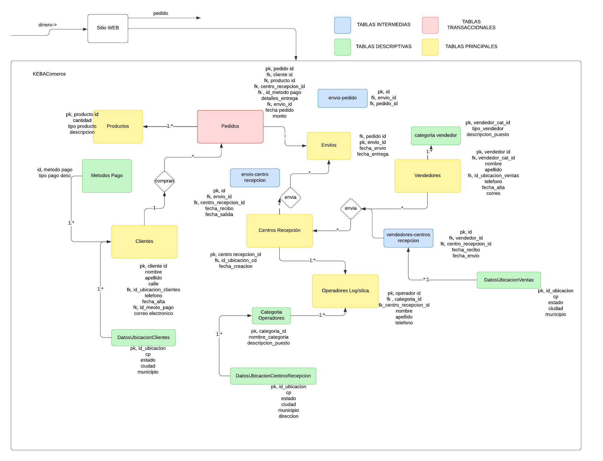
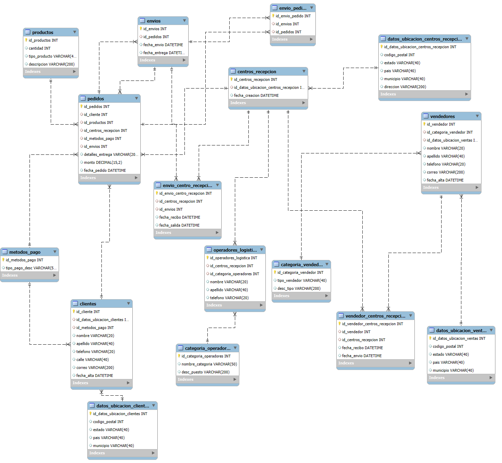

# Projecto SQL - KEBACommerce

## Primera Fase

#### Descripción
En esta fase, se propone la creación de un ecommerce propio llamado KEBACommerce, donde se propone tener acciones como hacer pedidos en una página en linea, pero teniendo también datos importantes detrás como del vendedor en cuestion, los centros de distribución y envios, asi como productos también . Este proyecto propone resolver la problemática de la realización de una empresa que quiero hacer en el futuro, un ecommerce, lo cual planeo hacer en un tiempo no mayor a 10 años, limitando mi nicho de mercado pero dandome una idea clara de lo que implicaria a nivel de modelo de datos

#### Primer Boceto
Se presenta el primer boceto, identificando actores, relaciones y acciones principales , donde destacan:
* Clientes: Perfil del cliente, con información relevante en general
* Pedidos: Los articulos que pidió un cliente, es la transacción principal y fundamento del negocio . Sin pedido no existimos
* Productos: El listado de productos asi como su categoria y cantidades en existencia
* Envios: Representa un envio como tal, es decir, el vinculo entre pedido y centro de distribución
* Centro Distribución: Representa el estado del pedido, cuando se tengan los items listos para su distribución , es donde se juntan los productos de vendedores y los operadores de logistica los tratan
* Operadores Logistica: Este actor decidí agregarlo a parte porque a mi parecer vale la pena saber más cosas sobre los operadores de logística que intervienen en el centro de distribución para analíticas en un futuro
* Vendedores: Los vendedores son un pilar para que existan sus items en nuestro centro de distribución y de ahí se pueda lograr un envio, conectado a un pedido

#### Diagrama Entidad Relación (Workbench)
Con la ayuda del [script](./project.sql) se realizó el siguiente diagrama entidad relación en MySQL Workbench

A continuación se presentan las tablas y una breve descripción de los campos:
Tabla 1 - Clientes
| Llave | Nombre | Description | Tipo |
| --- | --- | --- | --- |
| PK | `id_cliente` | Identificador primario de cliente | INT
| FK | `id_datos_ubicacion_clientes` | Identificador datos ubicación cliente | INT
| FK | `id_metodos_pago` | Identificador metodos de pago cliente | INT
| - | `nombre` | Nombre del cliente | VARCHAR
| - | `apellido` | Apellido del cliente | VARCHAR
| - | `telefono` | Telefono del cliente | VARCHAR
| - | `calle` | Calle donde vive el cliente | VARCHAR
| - | `correo` | Correo electronico del cliente | VARCHAR
| - | `fecha_alta` | Fecha de alta del cliente | TIMESTAMP

Tabla 2 - Envios
| Llave | Nombre | Description | Tipo |
| --- | --- | --- | --- |
| PK | `id_envios` | Identificador primario del envio | INT
| FK | `id_pedidos` | Identificador del pedido | INT
| - | `fecha_envio` | Fecha de envio | TIMESTAMP
| - | `fecha_entrega` | Fecha de entrega del envío| TIMESTAMP

Tabla 3 - Centro Recepción
| Llave | Nombre | Description | Tipo |
| --- | --- | --- | --- |
| PK | `id_centros_recepcion` | Identificador primario del centro de recepción | INT
| FK | `id_datos_ubicacion_centros_recepcion` | Identificador de datos específicos para centros de recepción | INT
| - | `fecha_creacion` | Fecha de creación del centro | TIMESTAMP
