# Projecto SQL - KEBACommerce

## Primera Fase

#### Descripción
En esta fase, se propone la creación de un ecommerce propio llamado KEBACommerce, donde se propone tener acciones como hacer pedidos en una página en linea, pero teniendo también datos importantes detrás como del vendedor en cuestion, los centros de distribución y envios, asi como productos también . Este proyecto propone resolver la problemática de la realización de una empresa que quiero hacer en el futuro, un ecommerce, lo cual planeo hacer en un tiempo no mayor a 10 años, limitando mi nicho de mercado pero dandome una idea clara de lo que implicaria a nivel de modelo de datos

#### Primer Boceto
Se presenta el primer boceto, identificando actores, relaciones y acciones principales , donde destacan:
* Clientes: Perfil del cliente, con información relevante en general
* Pedidos: Los articulos que pidió un cliente, es la transacción principal y fundamento del negocio . Sin pedido no existimos
* Productos: El listado de productos asi como su categoria y cantidades en existencia
* Envios: Representa un envio como tal, es decir, el vinculo entre pedido y centro de distribución
* Centro Distribución: Representa el estado del pedido, cuando se tengan los items listos para su distribución , es donde se juntan los productos de vendedores y los operadores de logistica los tratan
* Operadores Logistica: Este actor decidí agregarlo a parte porque a mi parecer vale la pena saber más cosas sobre los operadores de logística que intervienen en el centro de distribución para analíticas en un futuro
* Vendedores: Los vendedores son un pilar para que existan sus items en nuestro centro de distribución y de ahí se pueda lograr un envio, conectado a un pedido

#### Diagrama Entidad Relación (Workbench)
Con la ayuda del [script](./project.sql) se realizó el siguiente diagrama entidad relación en MySQL Workbench

A continuación se presentan las tablas y una breve descripción de los campos:
Tabla 1 - Clientes
| Llave | Nombre | Description | Tipo |
| --- | --- | --- | --- |
| PK | `id_cliente` | Identificador primario de cliente | INT
| FK | `id_datos_ubicacion_clientes` | Identificador datos ubicación cliente | INT
| FK | `id_metodos_pago` | Identificador metodos de pago cliente | INT
| - | `nombre` | Nombre del cliente | VARCHAR
| - | `apellido` | Apellido del cliente | VARCHAR
| - | `telefono` | Telefono del cliente | VARCHAR
| - | `calle` | Calle donde vive el cliente | VARCHAR
| - | `correo` | Correo electronico del cliente | VARCHAR
| - | `fecha_alta` | Fecha de alta del cliente | TIMESTAMP

Tabla 2 - Envios
| Llave | Nombre | Description | Tipo |
| --- | --- | --- | --- |
| PK | `id_envios` | Identificador primario del envio | INT
| FK | `id_pedidos` | Identificador del pedido | INT
| - | `fecha_envio` | Fecha de envio | TIMESTAMP
| - | `fecha_entrega` | Fecha de entrega del envío| TIMESTAMP

Tabla 3 - Centro Recepción
| Llave | Nombre | Description | Tipo |
| --- | --- | --- | --- |
| PK | `id_centros_recepcion` | Identificador primario del centro de recepción | INT
| FK | `id_datos_ubicacion_centros_recepcion` | Identificador de datos específicos para centros de recepción | INT
| - | `fecha_creacion` | Fecha de creación del centro | TIMESTAMP

Tabla 4 - Pedidos
| Llave | Nombre | Description | Tipo |
| --- | --- | --- | --- |
| PK | `id_pedidos` | Identificador del pedido| INT
| FK | `id_cliente` | Identificador del cliente que hizo el pedido | INT
| FK | `id_productos` | Identificador foraneo para tabla de productos | INT
| FK | `id_centros_recepcion` | Identificador foranea para centros de distribucion | INT
| FK | `id_metodos_pago` | Identificador foranea para forma de pago | INT
| FK | `id_envios` | Identificador foranea para envio del pedido  | INT
| - | `monto` | Costo total del pedido| DECIMAL
| - | `detalles_entrega` | Detalles extra del pedido  | VARCHAR
| - | `fecha_pedido` | Fecha en que fue hecho el pedido| TIMESTAMP

Tabla 5 - Envio-Pedido
| Llave | Nombre | Description | Tipo |
| --- | --- | --- | --- |
| PK | `id_envio_pedido` | Identificador de tabla puente entre envio y pedido| INT
| FK | `id_envios` | Identificador foraneo en tabla de envios | INT
| FK | `id_pedidos` | Identificador foraneo en tabla de pedidos | INT

Tabla 6 - Vendedores
| Llave | Nombre | Description | Tipo |
| --- | --- | --- | --- |
| PK | `id_vendedor` | Identificador del vendedor| INT
| FK | `id_categoria_vendedor` | Identificador de categoria del vendedor | INT
| FK | `id_datos_ubicacion_ventas` | Identificador para datos propios de ubicación de vendedores | INT
| - | `nombre` | Nombre del cliente | VARCHAR
| - | `apellido` | Apellido del cliente | VARCHAR
| - | `telefono` | Telefono del cliente | VARCHAR
| - | `correo` | Correo electronico del cliente | VARCHAR
| - | `fecha_alta` | Fecha de alta del cliente | TIMESTAMP

Tabla 7 - Vendedores-Centros Recepción
| Llave | Nombre | Description | Tipo |
| --- | --- | --- | --- |
| PK | `id_vendedor_centros_recepcion` | Identificador primario de tabla| INT
| FK | `id_vendedor` | Identificador foraneo del vendedor | INT
| FK | `id_centros_recepcion` | Identificador foraneo del centro de recepcion | INT
| - | `fecha_recibo` | Fecha de recibo en centro de distribucion de articulos | TIMESTAMP
| - | `fecha_envio` | Fecha de envio para pedido | TIMESTAMP

Tabla 8 - Operadores logística
| Llave | Nombre | Description | Tipo |
| --- | --- | --- | --- |
| PK | `id_operadores_logistica` | Identificador primario de tabla | INT
| FK | `id_centros_recepcion` | Identificador foraneo en tabla centro de costos | INT
| FK | `id_categoria_operadores` | Identificador foraneo del categoria de operador| INT
| - | `nombre` | Nombre del cliente | VARCHAR
| - | `apellido` | Apellido del cliente | VARCHAR
| - | `telefono` | Telefono del cliente | VARCHAR

Tabla 9 - Categoria Vendedor
| Llave | Nombre | Description | Tipo |
| --- | --- | --- | --- |
| PK | `id_categoria_vendedor` | Identificador primario de tipo de vendedor| INT
| - | `tipo_vendedor` | Categoria del tipo de vendedor| VARCHAR
| - | `desc_tipo` | Descripcion del tipo de vendedor, mayor detalle | VARCHAR

Tabla 10 - Datos-ubicacion-ventas
| Llave | Nombre | Description | Tipo |
| --- | --- | --- | --- |
| PK | `id_datos_ubicacion_ventas` | Identificador primario de tipo de tabla| INT
| - | `codigo_postal` | Codigo postal de ubicacion| INT
| - | `estado` |Estado en donde se encuentra ubicacion | VARCHAR
| - | `pais` |Pais en donde se encuentra ubicacion | VARCHAR
| - | `municipio` |Municipio en donde se encuentra ubicacion | VARCHAR

Tabla 11 - Datos-ubicacion-centros-distribución
| Llave | Nombre | Description | Tipo |
| --- | --- | --- | --- |
| PK | `id_datos_ubicacion_centros_recepcion` | Identificador primario de tipo de tabla| INT
| - | `codigo_postal` | Codigo postal del centro| INT
| - | `estado` |Estado en donde se encuentra el centro | VARCHAR
| - | `pais` |Pais en donde se encuentra el centro | VARCHAR
| - | `municipio` |Municipio en donde se encuentra el centro | VARCHAR
| - | `direccion` |Direccion detallada del centro | VARCHAR

Tabla 12 - Categoria Operadores
| Llave | Nombre | Description | Tipo |
| --- | --- | --- | --- |
| PK | `id_categoria_operadores` | Identificador primario de tipo de operador| INT
| - | `nombre_categoria` | Categoria del tipo de operador| VARCHAR
| - | `desc_puesto` | Descripcion del tipo de operador, mayor detalle | VARCHAR

Tabla 13 - Datos-ubicacion-clientes
| Llave | Nombre | Description | Tipo |
| --- | --- | --- | --- |
| PK | `id_datos_ubicacion_clientes` | Identificador primario de tipo de tabla| INT
| - | `codigo_postal` | Codigo postal del cliente| INT
| - | `estado` |Estado en donde se encuentra el cliente | VARCHAR
| - | `pais` |Pais en donde se encuentra el cliente | VARCHAR
| - | `municipio` |Municipio en donde se encuentra el cliente | VARCHAR

Tabla 14 - Metodos de pago
| Llave | Nombre | Description | Tipo |
| --- | --- | --- | --- |
| PK | `id_metodos_pago` | Identificador primario de tipo de tabla| INT
| - | `tipo_pago_desc` | Tipo de pago ya sea tarjeta, credito, debito o efectivo| INT

Tabla 15 - Productos
| Llave | Nombre | Description | Tipo |
| --- | --- | --- | --- |
| PK | `id_productos` | Identificador primario de tipo de tabla| INT
| - | `cantidad` | Cantidad en almacen| INT
| - | `tipo_producto` | Categoria de producto| VARCHAR
| - | `descripcion` | Descripcion del producto para mayor detalle | VARCHAR

Tabla 16 - Envio-Centro-recepción
| Llave | Nombre | Description | Tipo |
| --- | --- | --- | --- |
| PK | `id_envio_centro_recepcion` | Identificador primario del envio | INT
| FK | `id_centros_recepcion` | Identificador del centro de recepción | INT
| FK | `id_envios` | Identificador del envio | INT
| - | `fecha_recibo` | Fecha de recibo  | TIMESTAMP
| - | `fecha_salida` | Fecha de salida| TIMESTAMP

## Segunda Fase
Se adjunta la imagen donde se muestra la correcta creación de tablas en MYSQL Workbench.
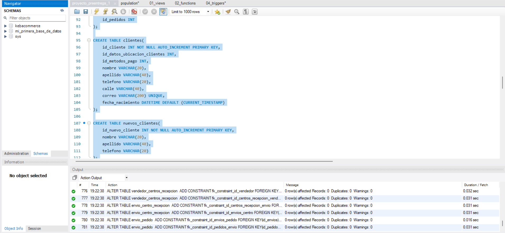

Ahora cuando se hace la inserción por medio de comandos *insert* para validar tanto relaciones hechas en la primera fase como para reforzar la inserción normal a tablas.
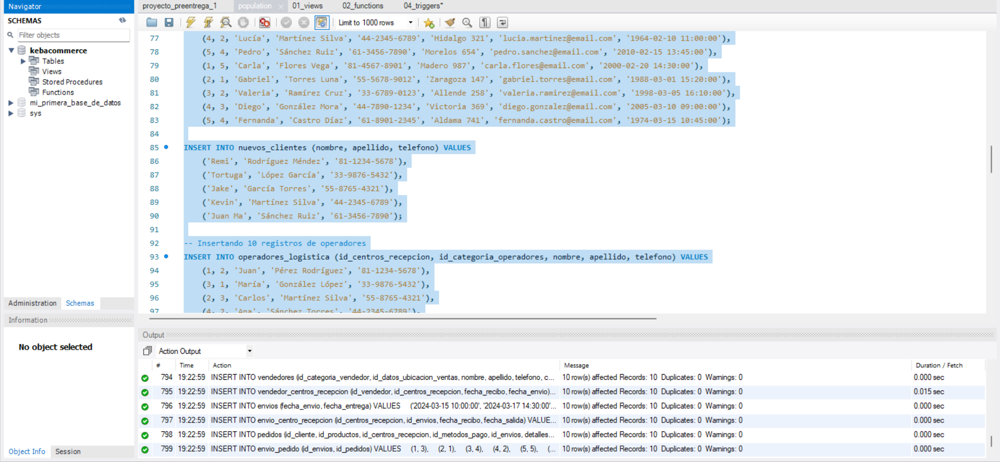

* VISTAS
    De manera general, se comprueba su correcta implementación mediante el archivo [01_views.sql](./objetos/01_views.sql).
    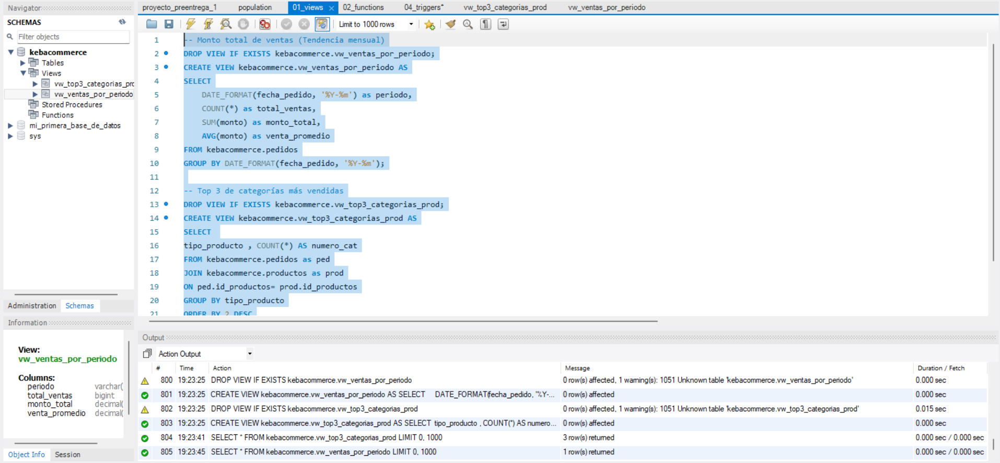

    * vw_ventas_por_periodo : Para saber las ventas por periodo (mes) y tener una distribución a lo largo de pasado un año y evaluar desempeño general. Esta vista tiene la flexibilidad de hacerse por año o día también, sólo modificando una pequeña condición.
    * vw_top3_categorias_prod: Porque al ser una pequela/mediana empresa planeamos meterle publicidad sólo a los top3 categorías,cuando hallamos crecido le daremos mayor visibilidad a futuros productos.

vw_ventas_por_periodo        |  vw_top3_categorias_prod
:-------------------------:|:-------------------------:
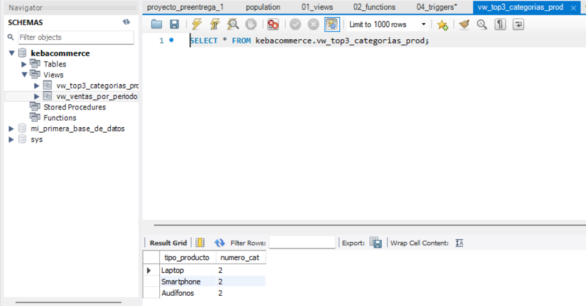  |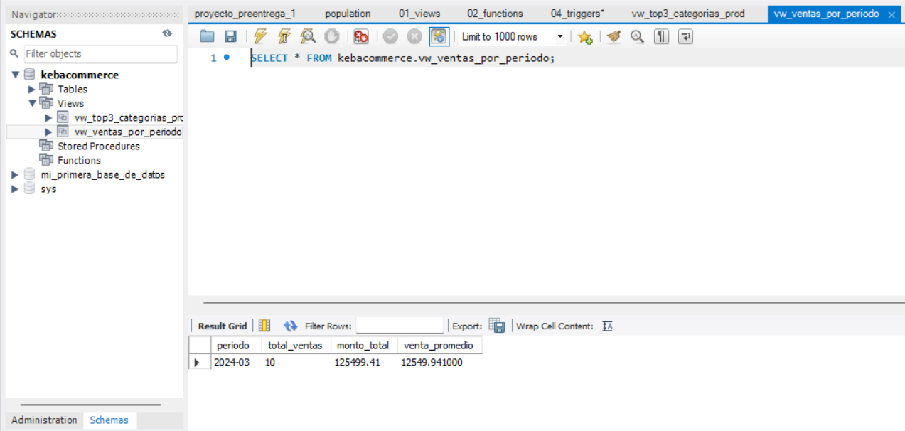

* FUNCIONES
    Archivo que genera funciones se encuentra en [02_functions.sql](./objetos/02_functions.sql)
    * fx_mayor_edad: Para saber cupantos clientes o registrados en nuestra plataforma tienen mayoría de edad y decidir cómo proceder en caso de tener casos donde no se cumpla dicha mayoría de edad.

    * fx_obtener_lada: Obtener la lada nos dará más oportunidad de entender reglas de negocio o publicidad sobre los celulares, teniendo la lada, tendremos también oportunidad de recomendar productos que sean compatibles con dicha lada, tecnología, planes de pago y saldo telefónico, etc.

fx_mayor_edad        |  fx_obtener_lada
:-------------------------:|:-------------------------:
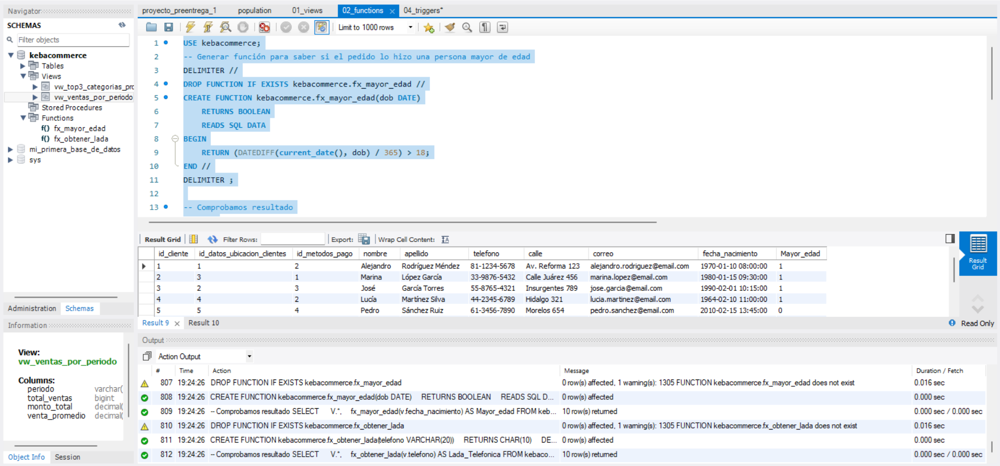  |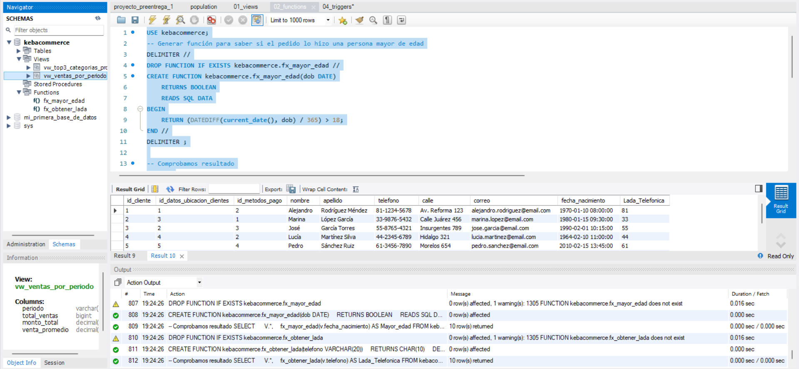

* STORED PROCEDURES
    El archivo que genera los stored procedures se encuentra en [03_procedures.sql](./objetos/03_procedures.sql) . Cabe resaltar que gracias a la modularidad de los procedimientos, pudimos utilizar las funciones para no tener que trabajar doble.

    * sp_envio_diff: Este procedimiento se utiliza para saber detalles temporales, en minutos, horas y días sobre los días de entrega y de salida de los envios. Y así tener una mejor estimación y mayor nivel de precisión en las predicciones de entrega que se muestran en nuestro sitio web.
    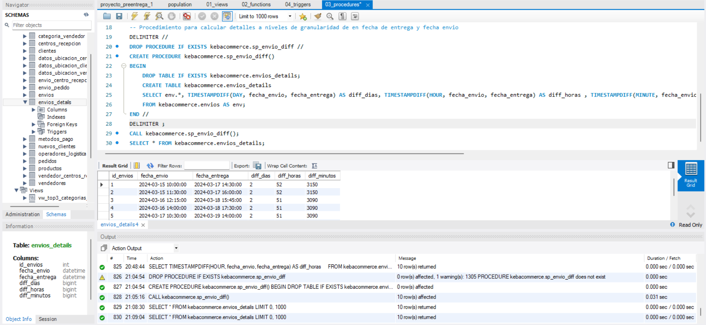
    * sp_clientes_no_mayores: Este procedimiento se utiliza para saber qué clientes no son mayores de edad, principalmenten nos auxiliamos de la función creada anteriormente en el apartado de funciones para la creación de este stored procedure que creará una nueva tabla con esa información y así saber qué postura tomar en caso de que tengamos un cliente que haya hecho un pedido siendo menor de edad, lo cuál hará más eficaz y de mejor atención nuestro servicio al cliente.
    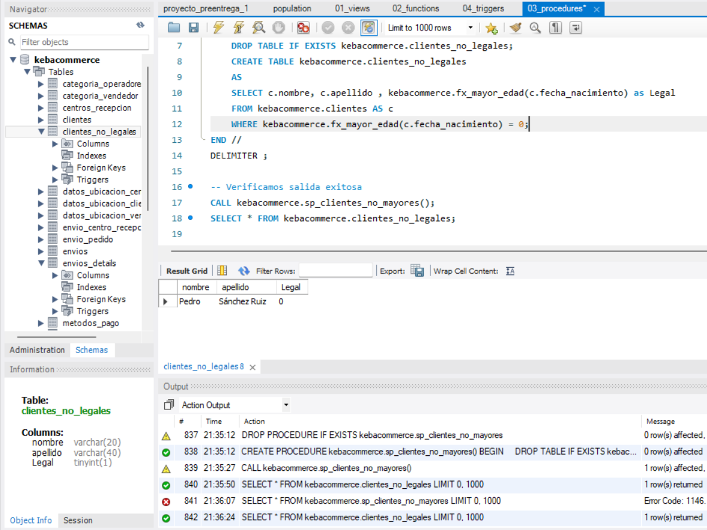

* TRIGGERS
    Del lado izquierdo se pueden apreciar los triggers añadidos y los resultados en la consola, indicando tanto correcta cración, como nueva adición y mensaje de error en caso de no pasar la condición dada por *tg_validar_cliente_telefono* , derivado del archivo [04_triggers.sql](./objetos/04_triggers.sql).
    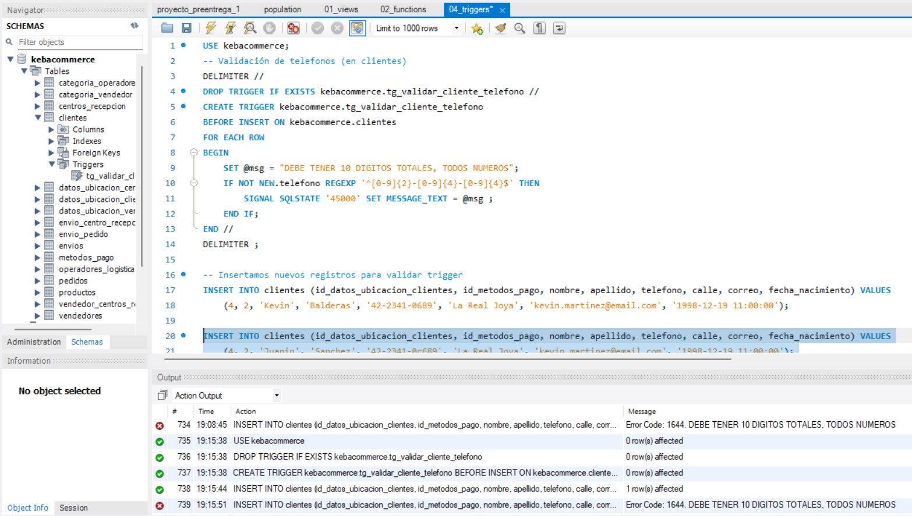

    * tg_agregar_nuevo_cliente : Se insertan registros en otra tabla creada, basado en si hay nuevos clientes o no. Ya que existe un cliente molesto que siempre pregunta cuántos clientes nuevos hay desde la última vez que nos vemos, entonces a manera de backup temporal, cada vez que tenemos esa situación, corremos el trigger y en la tabla final tenemos ese temporal. 

    * tg_validar_cliente_telefono : Se utiliza una expresión regular para validar número de telefono, de 10 digitos solo y sólo números, no letras o cosas raras

Comparación final entre ambos triggers así como su resultado.
tg_agregar_nuevo_cliente        |  tg_validar_cliente_telefono
:-------------------------:|:-------------------------:
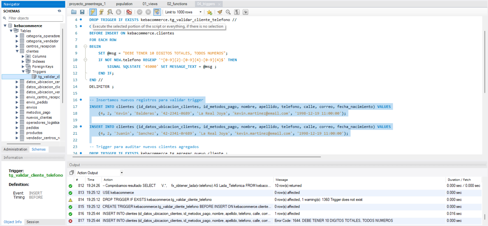  |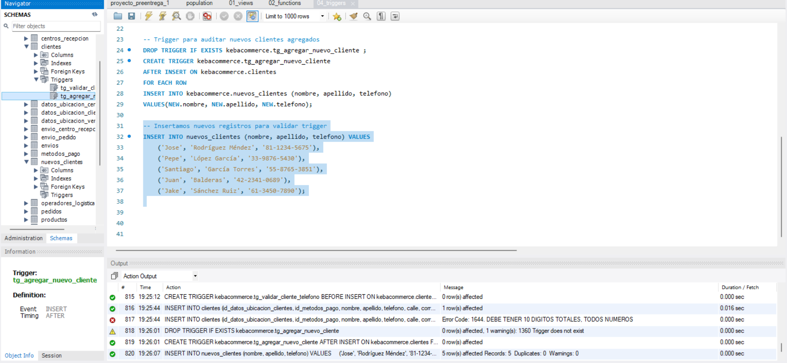

